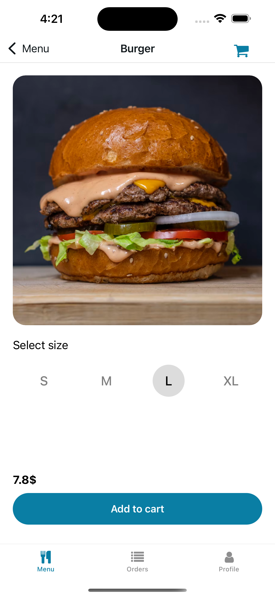

# 🍔 Food Delivery Demo App

A demo project built with **Expo (React Native)** and **Supabase**, inspired by modern food delivery applications.  
The app integrates authentication, a shopping cart system, real-time order management, and an **Admin / User** mode.

---

## 🚀 Features

### 👤 User

- Sign up & log in with Supabase
- List of products
- Add unlimited products to the cart
- Checkout and place an order
- Secure payment integration with **Stripe**

### 🛠️ Admin

- Create and edit products
- Update order status in real time:  
  `new → cooking → delivering → delivered`

---

## 🛠️ Tech Stack

- **Expo (React Native)** – cross-platform mobile development
- **Supabase** – authentication & database
- **React Navigation** – multi-screen navigation
- **Stripe** – secure payment integration

---

## 📸 Preview

<p align="center">
   
   
   
   
   
   
   
</p>

---

## 🗄️ Database schema


---

## ⚡ Installation

1. Clone the project:

   ```bash
   git clone https://github.com/your-username/food-delivery-demo.git
   cd food-delivery-demo

   ```

2. Install dependencies:

   ```bash
   npm install

   ```

3. Start the app:
   ```bash
   npx expo start
   ```
